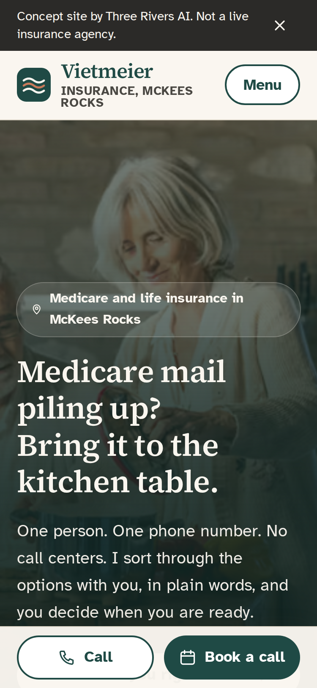
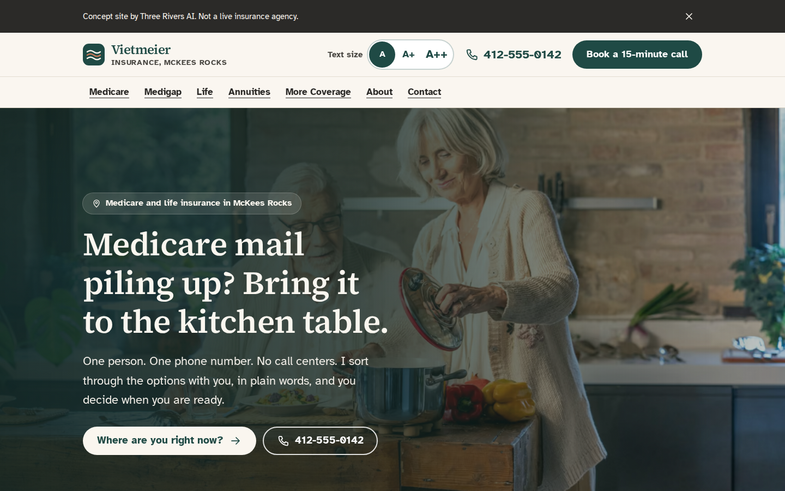

# Vietmeier Insurance concept site

A demo from Three Rivers AI. It shows a local Medicare and life insurance agent in McKees Rocks, PA what his website could look and feel like. **It is a sales piece, not a live agency site.** Every page carries a demo banner and a `noindex, nofollow` tag.

- **Stack:** Astro 5 (static output), TypeScript, Tailwind CSS 4, Motion (motion.dev). Fonts are self-hosted through Fontsource.
- **No trackers:** no analytics, no pixels, no cookies, no map embeds, no third-party requests.
- **Pages:** Home, Medicare, Medigap, Life, Annuities, More Coverage, About, Contact, Privacy, Terms.
- **Plan:** [`docs/PLAN.md`](docs/PLAN.md)

| 375px | 1440px |
|---|---|
|  |  |

Full-page captures: [`docs/screens/home-375.png`](docs/screens/home-375.png), [`docs/screens/home-1440.png`](docs/screens/home-1440.png). There are also shots of the chooser open, the largest text size and the contact form in [`docs/screens`](docs/screens).

## Run it

```bash
npm install
npm run dev          # http://localhost:4321
npm run build        # static site in dist/
npm run preview      # serve dist/ on :4321
```

Checks (run `npm run build && npm run preview` in another terminal first for `verify` and `screens`):

```bash
npm run check        # astro check + copy rules (banned words, em dashes, exclamation marks, slanted type, emoji)
npm run verify       # 36 Playwright checks: layout at 3 widths x 3 text sizes, chooser, accordion,
                     # reduced motion, keyboard focus, tap targets, form, compliance, demo banner
npm run screens      # regenerates docs/screens
npm run photos       # rebuilds AVIF/WebP from photo-src/ (only when photos change)
```

## Deploy (Vercel preview)

The repo is ready for Vercel. `vercel.json` sets the framework, the build command, the `dist` output and an `X-Robots-Tag: noindex, nofollow` header on every response.

1. In Vercel, go to **Add New > Project**, import `three-rivers-ai/vietmeier-insrance`, and keep the detected Astro settings.
2. Pushes to any branch other than production get a preview URL. You can also run `npx vercel` from the repo for a one-off preview.
3. Leave Vercel Web Analytics and Speed Insights **off**. The site promises no tracking.

## Lighthouse (mobile)

Lighthouse 12, mobile form factor, run against the production build (`astro preview`) in headless Chromium on 2026-09-28.

| Page | Performance | Accessibility | Best practices |
|---|---|---|---|
| Home | 99 | 100 | 100 |
| Medicare | 100 | 100 | 100 |
| Medigap | 97 | 100 | 100 |
| Life | 100 | 100 | 100 |
| Annuities | 100 | 100 | 100 |
| More Coverage | 100 | 100 | 100 |
| About | 99 | 100 | 100 |
| Contact | 100 | 100 | 100 |
| Privacy | 100 | 100 | 100 |
| Terms | 100 | 100 | 100 |

- **Home metrics:** LCP 1.8 s, TBT 50 ms, CLS 0.
- **SEO:** scores 66. That is on purpose, because the `noindex` tag keeps the concept out of search.
- **Caveat:** scores will shift a little on Vercel's CDN. Re-run on the preview URL before showing the client.

## Placeholders to fill

Every agent fact lives in [`src/data/site.ts`](src/data/site.ts) and shows on the page in brackets.

| Placeholder | Where it shows |
|---|---|
| `[Agent Name]` | Meet the agent, footer, Terms |
| `[License #]`, `[NPN]` | Meet the agent, footer, Terms |
| `[Address]`, `[ZIP]` | Local band, Contact, footer |
| `[Phone]` and the fake number 412-555-0142 (`tel:+14125550142`) | Header, mobile call bar, every call button |
| `[email]@vietmeierinsurance.example` | Privacy page |
| `[Weekday hours]` | Local band, Contact, footer |
| `Carriers: [to be listed]` | Meet the agent, footer. Text only, never carrier logos without permission. |
| `[#] organizations`, `[#] products` | [`src/components/MedicareDisclaimer.astro`](src/components/MedicareDisclaimer.astro), the only copy of the disclaimer |
| Bio brackets: `[a few blocks from the office]`, `[year]`, `[previous work]`, hobbies, neighborhood, family | [`src/components/MeetAgent.astro`](src/components/MeetAgent.astro) |
| "Agent photo here" silhouette | [`src/components/AgentPlaceholder.astro`](src/components/AgentPlaceholder.astro). Replace with a real headshot, never a stock face. |
| Three review cards | [`src/components/Reviews.astro`](src/components/Reviews.astro). Use real client words only, with written permission. |
| `[same business day]` voicemail promise | Contact page |
| `[date]` last updated | Privacy, Terms |

**Confirm with the agent before launch:**
- The "What does it cost to talk with you?" answer in [`src/data/answers.ts`](src/data/answers.ts), which says the plan price is the same through him or on your own.
- The list of lines he carries in `MeetAgent.astro`.
- Whether he sells for every Medicare Advantage organization in the area. If he does, 42 CFR 422.2267(e)(41) requires different disclaimer wording (see the comment in `MedicareDisclaimer.astro`).

## Compliance notes

- **Disclaimer:** `<MedicareDisclaimer />` uses the 42 CFR 422.2267(e)(41) wording for a marketing organization that does not sell every plan. The text was read from eCFR on 2026-09-28 (last amended 91 FR 17583, Apr. 6, 2026).
  - It appears in the footer of every page, in a boxed version on Medicare and Medigap, and in the contact form's confirmation.
  - **Re-check eCFR before launch.** The rule also says the disclaimer must be spoken on sales calls before benefits are discussed.
- **Medicare facts:** every claim was checked against medicare.gov on 2026-09-28, and the page URL sits in a code comment next to it (see `Timeline.astro`, `Chooser.astro`, `answers.ts` and the Medicare and Medigap pages).
- **No figures:** no dollar amounts, premiums or penalty percentages appear anywhere.
- **No logos:** no Medicare card image, no CMS, Medicare or carrier logos.
- **Endorsement:** the footer and Terms say the agency is not connected with or endorsed by the U.S. government or the federal Medicare program.
- **Contact form:**
  - It never asks for a Medicare number, Social Security number, date of birth, medications or health conditions.
  - The consent checkbox starts unchecked.
  - Nothing is posted anywhere.
- **Before this goes live:** have a compliance reviewer or the agent's FMO sign off on the copy. This concept has not been through that review.

## Accessibility and ease of use

- **Type:** Atkinson Hyperlegible for body text, a typeface the Braille Institute designed for low-vision readers. Body text is 19px on mobile and 20px on desktop, with a 1.6 line height.
- **No slanted text:** every element uses `font-style: normal`. `verify` checks each element's computed style.
- **Text size:** the A / A+ / A++ control scales the whole site to 100%, 112.5% or 125%. The choice is saved in `localStorage` inside try/catch and applied before first paint.
- **Contrast:** body text meets AAA contrast (charcoal on paper is 13.3:1). Clay text uses a darker tone, `#8F4A30`, at 6.1:1. The original clay `#C8795A` is only used for decoration.
- **Tap targets and links:** buttons, nav links and form controls are at least 48px tall. Links are underlined, and focus rings are 3px and easy to see.
- **Reduced motion:** turns off the hero drift, scroll reveals, timeline drawing and smooth scrolling, and shows all content immediately.

## Photo credits

The full table is in [`public/photos/CREDITS.md`](public/photos/CREDITS.md).

- **Unsplash photos,** used under the [Unsplash License](https://unsplash.com/license):
  - Md Ishak Raman (hero kitchen table)
  - Vitaly Gariev (grandparent)
  - Joshua Woroniecki (couple walking)
  - Jocelyn Allen (Clemente Bridge)
  - Zhen Yao (South Side Slopes)
  - Cht Gsml (paperwork)
- **Rowhouses:** Cbaile19 ("Father Pitt") on Wikimedia Commons, CC0.
- **Originals and conversion:** the original files are in `photo-src/`. `npm run photos` converts them into AVIF and WebP at several widths.
- **Gaps:**
  - No free, unstaged front-porch photo was found, so that slot uses other photos.
  - The hero shows a couple cooking at a kitchen table, not doing paperwork.
  - The walking-couple photo was taken in England.
  - Swap in local photos from the agent if he has them.
